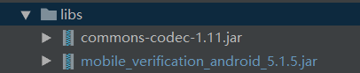

# 1. 开发环境配置

sdk技术问题沟通QQ群：609994083</br>

**注意事项：**

1. **获取token和取号服务必须打开数据流量并且手机操作系统给予应用数据权限才能使用**
2. **取号请求过程需要消耗用户少量数据流量**
3. **认证取号服务目前支持中国移动2/3/4G**

## 1.1  总体使用流程

a. 调用SDK方法来获得token，步骤如下：

   a. 构造SDK中认证工具类AuthnHelper的对象； 
   
   b. 使用AuthnHelper中的umcLoginByType方法，获得token。
   
b. 携带token通过业务服务端到认证服务端的本机号码校验接口，进行号码校验

## 1.2  新建工程并导入SDK的jar文件

jar包集成方式：

将 `mobile_verification_android_5.1.5.jar` 拷贝到应用工程的libs目录下，如没有该目录，可新建；



## 1.3  配置AndroidManifest

**注意：为避免出错，请直接从Demo中复制带标签的代码**

添加必要的权限支持: 

```
   <uses-permission android:name="android.permission.INTERNET" />
   <uses‐permission android:name="android.permission.READ_PHONE_STATE" />
   <uses‐permission android:name="android.permission.ACCESS_WIFI_STATE" />
   <uses‐permission android:name="android.permission.ACCESS_NETWORK_STATE" />
   <uses‐permission android:name="android.permission.CHANGE_NETWORK_STATE" />
```

通过以上步骤，工程就已经配置完成了。接下来就可以在代码里使用统一认证的SDK进行开发了


## 1.4 SDK使用步骤

`AuthnHelper`是SDK的功能入口，所有的接口调用都得通过AuthnHelper进行调用。因此，调用SDK，首先需要创建一个AuthnHelper实例，其代码如下：

**示例代码：**

```
public void onCreate(Bundle savedInstanceState) {
    super.onCreate(savedInstanceState);
    mContext = this;    
    mAuthnHelper = AuthnHelper.getInstance(mContext.getApplicationContext());
    //AuthnHelper初始化
    mAuthnHelper.init(Constant.APP_ID, Constant.APP_KEY);
    //设置是否输出sdk日志
    mAuthnHelper.setDebugMode(true);
    
    }
```

## 1.5  实现回调

所有的SDK接口调用，都会传入一个回调，用于接收SDK返回的调用结果。结果以`JsonObject`的形式传递，`TokenListener`的实现示例代码如下：

```
mListener = new TokenListener() {
    @Override
    public void onGetTokenComplete(JSONObject jObj) {
        try {
               if (timer != null)
               timer.cancel();//回调的时候取消定时器
        } catch (Exception e) {
               e.printStackTrace();
        }
        if (jObj != null) {
            mResultString = jObj.toString();
            mHandler.sendEmptyMessage(RESULT);
            if (jObj.has("token")) {
                mtoken = jObj.optString("token");
            }
        }
    }
}
```

# 2  SDK方法说明

## 2.1 获取管理类的实例对象

### 2.1.1 方法描述

**原型**

````
public static AuthnHelper getInstance(Context context)
````

### 2.1.2 参数说明


| 参数      | 类型    |说明    |
| --------- | ----- |--------------------|
| context | Context |调用者的上下文环境，其中activity中this即可以代表|

## 2.2 获取校验凭证token

### 2.2.1 方法描述

开发者向统一认证服务器获取用户身份标识 openId 和临时凭证 token 。 

token：开发者服务端可凭临时凭证token通过3.1本机号码校验接口对本机号码进行验证。

注意：获取token前，开发者需提前申请 READ_PHONE_STATE 权限，否则会失败！

**原型**

````
public void umcLoginByType(String appId, String appKey, int setTimeOut, TokenListener mlistener)
````

### 2.2.2 参数说明

请求参数

| 参数        | 类型             |说明         |
| ---------- | ------- |--------------------|
| appId     | String    |应用的AppID        |
| appkey     | String   |应用密钥          |
| setTimeOut  | int     |请求服务端超时时间          |
| listener     |TokenListener  |TokenListener为回调监听器，是一个java接口，需要调用者自己实现；TokenListener是接口中的认证登录token回调接口，OnGetTokenComplete是该接口中唯一的抽象方法，即void OnGetTokenComplete(JSONObject  jsonobj) |

响应参数

OnGetTokenComplete的参数JSONObject，含义如下：

| 字段         | 类型      |含义         |
| ------------ | --------- |--------------------|
| resultCode | String  |接口返回码，“103000”为成功。具体响应码见4.1. 本机号码校验接口返回码|
| resultDesc  | String   |失败时返回：返回错误码说明   |
| token  | String   |成功时返回：临时凭证，token有效期2min，一次有效，同一用户（手机号）10分钟内获取token且未使用的数量不超过30个  |

## 2.2.3 示例

请求示例代码

````
mAuthnHelper.umcLoginByType(Constant.APP_ID, 
        Constant.APP_KEY, 12000,
        mListener)
````

响应示例

```
    {
    "resultCode": "103000",
    "resultDesc": "success",
    "token": 
"8484010001330200374D455979526A49354E6A59774E444D314E454E47516B4D3140687474703A2F2F3231312E31333
62E31302E3133313A383038302F40303103000402D59A6B040012383030313230313730383138313031343437050010D
2F28C555CB54316B7D031DE9F6F6B1EFF0020F07B4AAFC3B1499A250AAAB4272BBFB565B440FFA5C8257E90C28595956
CC224"
    }
```

# 3 平台接口说明

## 3.1 获取用户信息接口

业务平台或服务端携带用户授权成功后的token来调用统一认证服务端获取用户手机号码等信息。注：本接口仅适
用于5.3.0及以上版本SDK

### 3.1.1 业务流程

SDK在获取token过程中，用户手机必须在打开数据网络情况下才能获取成功，纯wifi环境下会自动跳转到SDK的短
信验证码页面（如果有配置）或者返回错误码


## 3.1.2 接口说明

请求地址：https://www.cmpassport.com/unisdk/rsapi/loginTokenValidate

协议： HTTPS

请求方法： POST+json,Content-type设置为application/json

回调地址：请参考开发者接入流程文档

## 3.1.3 参数说明

请求参数

| 参数    | 类型             |约束 |说明         |
| --------| ---------------- |----|--------------------|
| version | String |必选 |填2.0 |
| msgid | String |必选 |标识请求的随机数即可(1-36位) |
| systemtime | String |必选 |请求消息发送的系统时间，精确到毫秒，共17位，格式：20121227180001165 |
| strictcheck | String |必选 |暂时填写"0" |
| appid | String |必选 |业务在统一认证申请的应用id |
| expandparams | String |可选 |扩展参数 |
| token | String |必选 |需要解析的凭证值 |
| sign | String |必选 |当encryptionalgorithm≠"RSA"时，sign = MD5（appid + version + msgid + systemtime + strictcheck + token + appkey（注：“+”号为合并意思，不包含在被加密的字符串中），输出32位大写字母； 当encryptionalgorithm="RSA"，业务端RSA私钥签名（appid+token）, 服务端使用业务端提供的公钥验证签名（公钥可以在开发者社区配置） |
| encryptionalgorithm | String |可选 |开发者如果需要使用非对称加密算法时，填写“RSA”。（当该值不设置为“RSA”时，执行MD5签名校验） |

响应参数


| 参数    | 类型             |约束 |说明         |
| --------| ---------------- |----|--------------------|
| inresponseto | String |必选 |对应的请求消息中的msgid |
| systemtime | String |必选 |响应消息发送的系统时间，精确到毫秒，共17位，格式：20121227180001165 |
| resultcode | String |必选 |返回码 |
| msisdn | String |可选 |表示手机号码 |

## 3.1.4 示例

请求示例

```java
    {
    appid = 3000******76;
    msgid = 335e06a28f064b999d6a25e403991e4c;
    sign = 213EF8D0CC71548945A83166575DFA68;
    strictcheck = 0;
    systemtime = 20180129112955435;
    token = STsid0000001517196594066OHmZvPMBwn2MkFxwvWkV12JixwuZuyDU;
    version = "2.0";
    }
```

响应示例代码

```java
    {
    inresponseto = 335e06a28f064b999d6a25e403991e4c;
    msisdn = 14700000000;
    resultCode = 103000;
    systemtime = 20180129112955477;
    }
```


## 3.2  使用短信验证码（可选）

SDK提供短信验证码作为网关取号的补充功能，获取token。

**注意：**

  目前短信验证码只支持移动和电信手机号码
  无网络时，不提供短验服务
  未获取`READ_PHONE_STATE`授权时，不提供短验服务
  
 方法调用如下图：


原型

```java
//获取短信验证码
public void sendSMS(final String phoneNum, final TokenListener listener)；

//短信验证码登录
public void getTokenSms(final String phoneNum, final String authCode, final TokenListener listener)；
```

## 3.2.1 参数说明

a.获取短信验证码
| 参数               | 类型             |说明         |
| ------------------ | --------- |--------------------|
| phoneNum | String      |手机号        |
| listener           | TokenListener      |TokenListener为回调监听器，是一个java接口，需要调用者自己实现；TokenListener是接口中的认证登录token回调接口，OnGetTokenComplete是该接口中唯一的抽象方法，即void OnGetTokenComplete(JSONObject  jsonobj)|

响应参数

OnGetTokenComplete的参数JSONObject，含义如下：

| 字段               | 类型      |含义         |
| ------------------ | --------- |--------------------|
| resultCode | int      |接口返回码，“103000”为成功。具体返回码见 SDK返回码|
| authTypeDes  | String   |登录类型中文描述 |

b.短信验证码登录
| 参数               | 类型             |说明         |
| ------------------ | --------- |--------------------|
| phoneNum | String      |手机号        |
| authCode | String      |短信验证码        |
| listener           | TokenListener      |TokenListener为回调监听器，是一个java接口，需要调用者自己实现；TokenListener是接口中的认证登录token回调接口，OnGetTokenComplete是该接口中唯一的抽象方法，即void OnGetTokenComplete(JSONObject  jsonobj)|

响应参数

OnGetTokenComplete的参数JSONObject，含义如下：

| 字段               | 类型      |含义         |
| ------------------ | --------- |--------------------|
| resultCode | int       |接口返回码，“103000”为成功。具体返回码见 SDK返回码|
| authType  | Int   |登录类型 |
| authTypeDes  | String   |登录类型中文描述 |
| selectSim  | String   |手机sim卡槽标识 |
| securityphone  | String   |手机加密号码 |
| openId  | String   |用户身份唯一标识（参数需在开放平台勾选相关能力后开放，如果勾选了一键登录能力，使用本方法时，不返回OpenID） |
| token  | String   |成功返回:临时凭证，token有效期2min，一次有效，同一用户（手机号）10分钟内获取token且未使用的数量不超过30个 |

## 3.2.2 请求示例代码

a.获取短信验证码

```
    AuthnHelper.getInstance(this).sendSMS(phoneNum, mListener}；
```

响应示例

```java
    {
    "resultCode": "103000",
    "desc": "true",
    "loginMethod":"sendsms"
    }
```

b.短信验证码登录

```
    AuthnHelper.getInstance(this).getTokenSms(phoneNum, authCode, mListener}；
```

响应示例

```java
    {
    "resultCode": "103000",
    "authType": "7",
    "authTypeDes": "短信验证码",
    "selectSim":"1",
    "openId": "003JI1Jg1rmApSg6yG0ydUgLWZ4Bnx0rb4wtWLtyDRc0WAWoAUmE",
    "token": "STsid0000001512438403572hQSEygBwiYc9fIw0vExdI4X3GMkI5UVw"
    }
```


## 4 返回码说明

## 4.1 SDK返回码

使用SDK时，SDK会在认证结束后将结果回调给开发者，其中结果为JSONObject对象，其中resultCode为结果响应码，103000代表成功，其他为失败。成功时在根据toke字段取出身份标识。失败时根据resultCode定位失败原因。

| 返回码 | 返回码描述                                                   |
| ------ | ------------------------------------------------------------ |
| 103000 | 成功             |
| 102101 | 无网络            |
| 102102 | 网络异常          |
| 102103 | 未开启数据网络    |
| 102121 | 用户取消登录     |
| 102223 | 数据解析异常     |
| 102203 | 输入参数错误     |
| 102507 | 请求超时，预取号、buffer页取号、登录时请求超时   |
| 200002 | 手机未安装sim卡   |
| 200005 | 用户未授权（READ_PHONE_STATE）   |
| 200010 | 取号请求时获取imsi失败    |
| 200014 | 手机号格式错误     |
| 200015 | 短信验证码格式错误     |
| 200016 | 更新KS失败     |
| 200021 | 数据解析异常                                                 |
| 200022 | 无网络状态                                                   |
| 200023 | 请求超时                                                     |
| 200024 | 数据网络切换失败                                             |
| 200025 | 未知错误一般出现在线程捕获异常，请配合异常打印分析           |
| 200026 | 输入参数错误                                                 |
| 200027 | 未开启数据网络                                               |
| 200028 | 网络请求出错       |
| 200031 | 生成token失败       |
| 200033 | 复用中间件获取Token失败        |
| 200035 | 协商ks失败        |
| 200036 | 预取号失败        |
| 200037 | 获取不到openid        |
| 200038 | 电信重定向失败         |
| 200039 | 电信取号接口返回失败      |
| 200043 | 获取不到btid      |
| 200050 | EOF异常      |
| 200072 | CA认证失败      |


## 4.2 获取手机号码接口返回码

| 返回码 | 返回码描述               |
| ------ | ------------------------ |
| 103000 | 返回成功                 |
| 103101 | 签名错误                 |
| 103113 | token内容错误            |
| 103119 | appid不存在              |
| 103133 | sourceid不合法           |
| 103211 | 其他错误                 |
| 103412 | 无效的请求               |
| 103414 | 参数校验异常             |
| 103811 | token为空                |
| 104201 | token失效或不存在        |
| 105018 | 用户权限不足             |
| 105019 | 应用未授权（开发者社区） |


## 4.3 本机号码校验接口返回码

| 返回码 | 说明                       |
| ------ | -------------------------- |
| 000    | 是本机号码（纳入计费次数） |
| 001    | 非本机号码（纳入计费次数） |
| 002    | 取号失败                   |
| 003    | 调用内部token校验接口失败  |
| 004    | 加密手机号码错误           |
| 102    | 参数无效                   |
| 124    | 白名单校验失败             |
| 302    | sign校验失败               |
| 303    | 参数解析错误               |
| 606    | 验证Token失败              |
| 999    | 系统异常                   |
| 102315 | 次数已用完                 |


## 5 Q&A

## 5.1  SDK使用网络问题？

a.在数据流量环境下，SDK可以正常从数据网关取号；

b.在wifi+数据流量环境下，SDK会调用方法强制将当前的wifi通道切换到数据流量通道，再通过数据网关正常取号（此过程大概会消耗用户1-2KB流量）；

c.在纯wifi环境下，SDK无法取号，将跳转到 短信上行 （Android，如果显式登录时传递了
AuthnHelper.AUTH_TYPE_SMS参数）或 短信验证码 （如果Android，如果显式登录时传递了
AuthnHelper.AUTH_TYPE_DYNAMIC_SMS参数；iOS，短信验证码开关设为NO）进行校验。

## 5.2 SDK支持三网运营商么？

    一键登录SDK支持三网，但是由于联通接口问题，目前IOS版SDK无法获取联通用户的手机号码；

    本机号码校验SDK仅支持中国移动用户的手机号码校验
    
 ## 5.3 OPPO终端网络问题
    
 a. 由于oppo操作系统增加了应用的数据网络使用权限，在手机wifi和数据网络同时打开时，应用首次打开，将默认使用wifi数据通道，且无法通过SDK强制切换到数据通道取号，会导致取号失败；
 
 b. 用户必须在纯数据网络环境打开应用，用户授权应用使用数据网络权限后，SDK切换功能才能使用。
    
## 5.4 关于Android 5.0操作系统切换数据通道问题

Android 5.x操作系统普遍存在wifi切数据网络通道延时问题，导致取号超时


<div STYLE="page-break-after: always;"></div>
